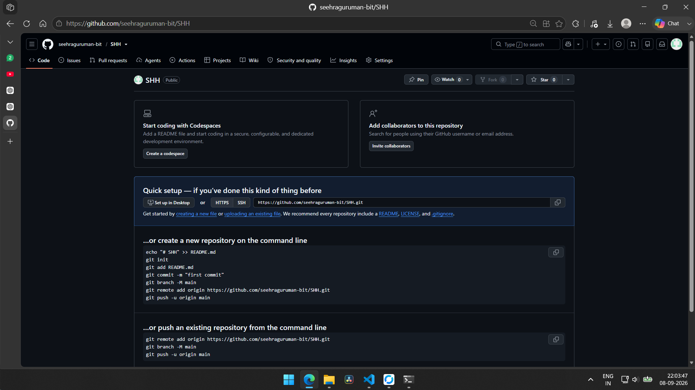

# SSH Remote Administration with Tailscale

Remote administration is an important part of modern computing and server management. System administrators often need to access computers and servers without being physically present near them. Secure Shell (SSH) is one of the most widely used technologies for securely accessing Linux systems through a command-line interface.

## Overview

In this project, an Ubuntu server is configured with an SSH server to enable remote command-line administration. Tailscale is then used to create a private network between the client device and the Ubuntu server. This allows SSH access even when the client and server are connected to different physical networks.

The main objective of this project is to understand and demonstrate how SSH and a private overlay network can be combined to provide convenient and secure remote administration of an Ubuntu server.

## Architecture

- Ubuntu server running an SSH service
- Tailscale private network for secure connectivity
- Client device connected through the Tailscale overlay network
- Remote login over SSH without exposing services to the public internet

## Why this matters

This project demonstrates:

- Secure remote administration
- Private connectivity across different networks
- Reduced exposure of administration services to the internet
- A simple and effective SSH access model for home labs and personal infrastructure

## Diagram



## Requirements

- Ubuntu server or VM
- OpenSSH installed and configured
- Tailscale installed on both the server and client
- Internet access for Tailscale authentication and connectivity

## Basic setup flow

1. Install and configure OpenSSH on the Ubuntu server.
2. Enable the SSH service and verify local access.
3. Install Tailscale on the server and client.
4. Authenticate both devices to the same Tailscale network.
5. Connect to the server using its Tailscale IP over SSH.
6. Prefer key-based authentication for better security.

## Example SSH command

```bash
ssh username@100.x.x.x
```

Replace `username` with the server user account and `100.x.x.x` with the Tailscale IP assigned to the Ubuntu host.

## Security notes

- Prefer SSH key authentication over passwords
- Restrict root access
- Keep the system updated and patched
- Use Tailscale ACLs and least-privilege access where appropriate

## Project status

This repository contains the project documentation and architecture illustration for the SSH + Tailscale remote administration setup.

## Future updates

This README is the main project page for GitHub. Any future notes, screenshots, diagrams, command examples, or progress updates should be added here so they remain visible on the repository homepage.

Recommended workflow:

- Add new images to the `images/` folder.
- Reference them in the README using Markdown image syntax, for example:

```md

```

- Add new sections below this file whenever you document a new step, result, or project improvement.

## License

This project is intended for educational and demonstration purposes. Use it responsibly and adapt it to your environment and security requirements.
